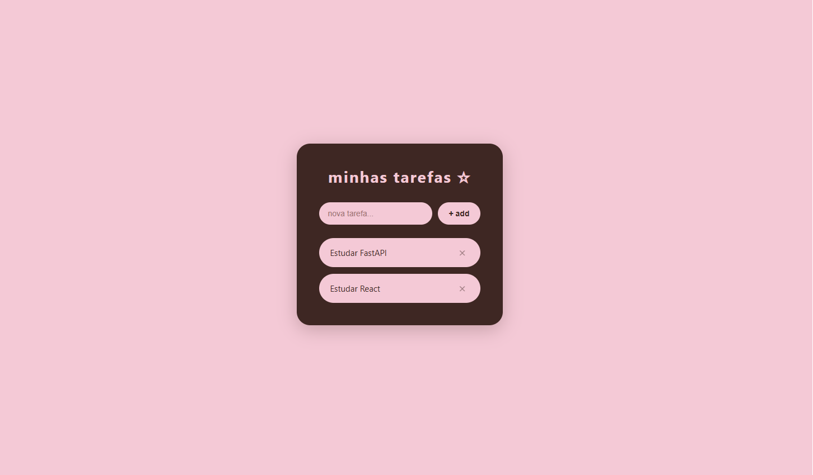

# ✦ minhas tarefas

um app de lista de tarefas com front-end e back-end se comunicando totalmente integrados

---

## ✦ o que eu aprendi construindo isso

* como funciona uma API REST (rotas GET e POST)
* validação de dados com Pydantic
* componentes React, `useState` e `useEffect`
* comunicação entre front-end e back-end
* como lidar com CORS
* uso do operador spread (`...`) no React

---

## ✦ tecnologias

* React + Vite
* FastAPI + Uvicorn
* Python + Pydantic
* CSS

---

## ✦ como rodar localmente

### back-end

```bash
cd projectName
pip install fastapi "uvicorn[standard]"
uvicorn main:app --reload
```

### front-end (em outro terminal)

```bash
npm install
npm run dev
```

acesse:

* http://localhost:5173
* http://localhost:8000/docs

---

## ✦ funcionalidades

* listagem de tarefas consumindo a API
* criação de novas tarefas
* marcação de tarefas como concluídas
* deleta tarefas

---

construído com curiosidade e muita tentativa e erro.
